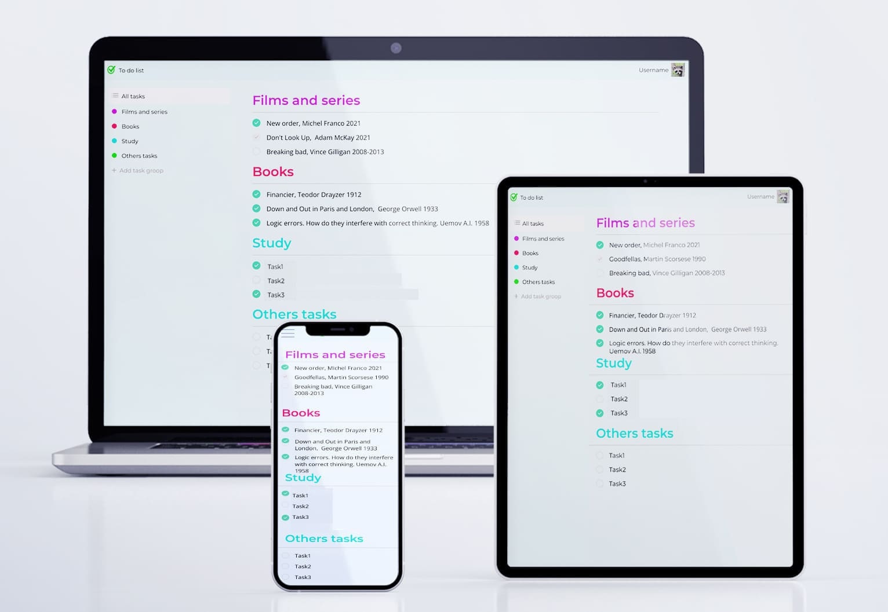

# To-do-list

This is client-server application for task management, data can be saved in local storage if user not authenticated or in database if user authenticated
## Frontend

- React
- Redux, Redux Toolkit
- TypeScript
- SCSS
- Webpack
- Figma

## Backend

- Express
- MongoDB
- JavaScript

## Figma

https://www.figma.com/file/n5p6P6gIghvaMJvw2hVIZz/To-do-list?node-id=606%3A2

## Client

https://to-do-list-client.vercel.app/

## Server

https://todolist-server11.herokuapp.com/ - not working, i fix it later

