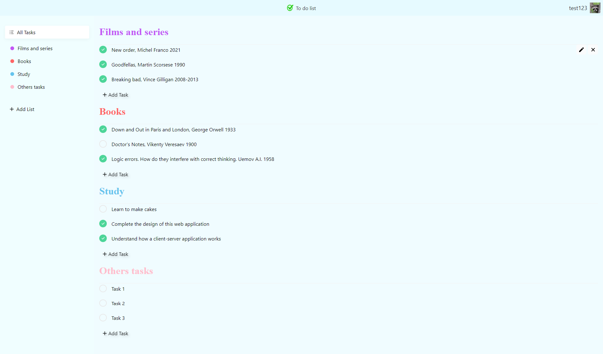

## Todo list
### In this project i develop client-server to do list application 
#### In Client part i use:
+ JavaScript
+ ReactJS
+ Redux
+ Webpack
+ SCSS
+ Figma

#### In Server part i use:
+ JavaScript
+ NodeJS
+ ExpressJS
+ MongoDB

## Figma
https://www.figma.com/file/n5p6P6gIghvaMJvw2hVIZz/Untitled?node-id=0%3A1

## Client
https://to-do-list-client.vercel.app/

## Server
https://secure-dusk-28937.herokuapp.com

